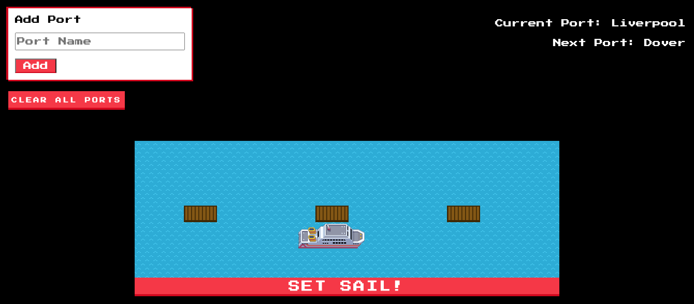

# Cruise Ships - A Manchester Codes JavaScript project

As part of the programming fundamentals module, we've been learning about OOP and TDD. This project exercises relevant concepts and revises DOM manipulation and a bit of CSS.

  
As a user, you can:

- [x] Add ports to the ship's itinerary
- [x] Sail from port to port, in order
- [x] Return to the start once you have reached the end
- [x] Clear all ports and start again at any point

 

## My approach to the exercise

The material from Manchester Codes is structured by first setting the aim for the current task, then listing some steps needed to complete it, and finally presenting a walkthrough of the code. 

My approach was to just read the task aim and try to achieve it by myself. When I got stuck, I would look at the steps needed for hints. Finally, I compared my working code with the walkthrough. I feel like I have consolidated a lot of concepts in doing this project, and practised a fair amount of JavaScript fundamentals. The main concepts that I've learnt for the first time, or that I've come to understand better are listed in the next section.

## What I've learnt doing this project

### Testing

I learnt...
- [x] matchers: toContain & not.toContain, toBeNull, toHaveBeenCalledWith
- [x] how to use jest.fn() to create mocks and spies
- [x] stubs
- [x] the benefits of isolation in testing
- [x] about test coverage and how to use a coverage report to identify code not exercised

I practised...
- [x] describe blocks
- [x] using 'it' for test cases
- [x] 'expect' with matchers toBe, toBeInstanceOf, toHaveProperty, toThrow
  

### JavaScript (& general development)

I learnt...
- [x] how to turn user stories into domain models 
- [x] the basics of dependency injection
- [x] what Immediately Invoked Function Expressions are and how to use them to enable modules to be exported both in Node and in the browser
- [x] that child node lists are live! (so if we try a loop that depends on index numbers to remove all child nodes, it won't work, as during iteration the elements are re-indexed.)
- [x] how to create a simple animation with 2 different images and setInterval

I practised...
- [x] ES6 Classes
- [x] writing guard clauses for methods that take user input
- [x] DOM manipulation
- [x] Using form input data
- [x] debugging
  

### CSS

I learnt...
- [x] of the package [normalize.css](https://necolas.github.io/normalize.css/)
- [x] how to use CSS transitions to make a simple animation (the ship floating across the screen)
- [x] how to use the display property combined with JavaScript to make elements appear/disappear

I practised...
- [x] flexbox
- [x] using absolute & sticky positioning
  

***

See it live on [GitHub pages](https://anna-m-b.github.io/cruise-ships/)

## Authors 
Anna Balquin

## Acknowledgements
[Manchester Codes](https://www.manchestercodes.com), who designed this project.
***
